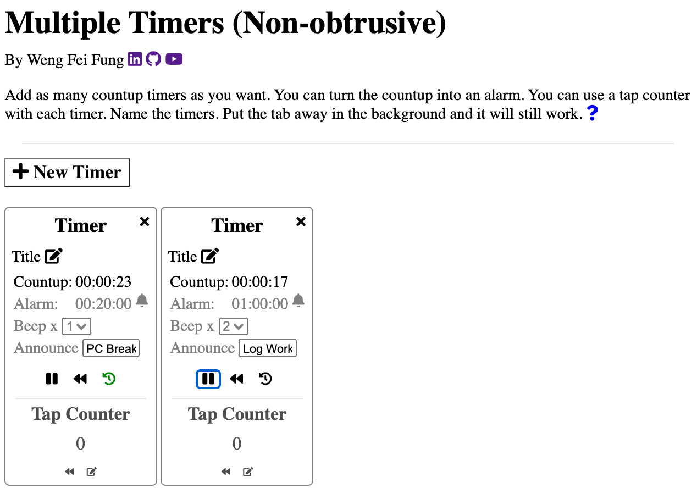

# Multitimers

  

:page_facing_up: Description:
---
By Weng Fei Fung. Simple multiple countups with alarms that can work in the background. Customize alarms with number of beeps and text-to-speech announcements. With tap counter. This is version 2 which allows countups and timers to work in the background as an inactive tab, and had required the code to be completely reworked.

:open_file_folder: Table of Contents:
---
- [Description](#description)
- [Preview](#computer-live-deployment)
- [Preview](#camera-preview)
- [Installation and Usage](#minidisc-installation-and-usage)

:computer: Live Deployment:
---
<a href="https://wengindustry.com/tools/multitimers" target="_blank">Check it out</a>

:camera: Preview:
---

## :minidisc: Installation and Usage:
Run as a HTML file or server file. No needed hands-on setup.